# 什么是游戏AI

AI英文是Artificial Intelligence， 中文翻译是人工智能，维基百科上给予人工智能的定义是：“智能代理（智能主体，intelligent agents）的研究与设计”。
而智能代理是指“可以观察周围环境并让作出的行动最大可能的获得成功的系统”。
但这并不是AI唯一的定义，“AI”只是术语，众所周知它是难以定义的，但它确实精确的描述了在大学中研究和教学的大部分的AI。
我们通常用术语“学术AI”来描述这些我们现在通常教学的部分。

电影动画师通常把他们创作的生命幻觉（ illusion of life）称作人工生命体，这个短语被认为是起源于迪士尼动画。但这是个非常不同的目标。
卡通角色并不需要“让行动成功的机会最大化”。  换句话说就是不定需要胜利。
相反在大多数情况下，他们希望观众可以直觉的去相信他们所实现的内容（尽管实际上这些明显是人工创作的）并创作出让人信服的体验，这些就是电影所做的。

而每个游戏都不相同，游戏的AI非常的广泛。相比经典的学术的AI，游戏AI的目标更近似于迪士尼的人工生命体。
卡通和游戏是为了娱乐而创作的，并不需要最大化成功率的认知的来建模，而是要叙述故事，创作体验，一种智能的幻觉（illusion of intelligence）。
在某些情况下，我们创作幻想所需的技术可以来源于学术AI，但大多数情况下却是不同的。
这里，我们用术语游戏AI来做描述，游戏AI专注于创作智慧的表现以及给给观众特别的体验，而不是创作出真实的智慧。

AI一般意义上分为3个阶段
. 感知 
. 决策 
. 行动
在某些AI步骤分类中分为 感知- 记忆/决策 - 预判- 行动

<div STYLE="page-break-after: always;"></div>

--------------------
--------------------


## 感知
AI所能获取的信息应该总是有限的。
引入“感知”的概念，用以模拟智能体的感官，从而获取一定的信息。
信息可能包括位置，自身属性，视野，周围角色属性，空间，碰撞，等等

模拟视觉/听觉  
辅助数据 记忆(数据定时衰退,LRU)/热力图/势力图

进攻位置图
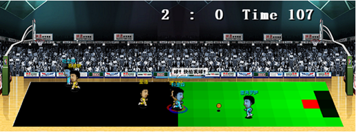
传球成功率
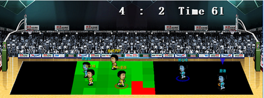

#### 获取方式
##### 轮询     
慢，但是可以一次收集多次使用
##### 事件触发 
连续发生，事件分派顺序
##### 触发器 


## 黑板
“黑板”简单来说就是可访问的共享数据，用于多模块间的数据共享。

## 自治智能体
正如其命，有自治动作的智能体称之为“自治智能体”。在《看门狗》《GTA》里，街上走路的人群或者开动的汽车
就是一种自治智能体。主角开车如果冲向它们，这些自治智能体能够自行判断并做出躲开的动作。

## 群体智能
如其名，与自治智能体相对，“群体智能”一般用于编队的AI或者集群的AI。例如足球游戏里，AI操控一方所有球员互相配合传球踢球
又或者射击游戏里，AI操控一支小队通过战术进攻据点
又或者rpg游戏里，小队的站位

## 场景智能/战略智能
特定游戏中，比如如何刷怪，如何控制场景资源生产，如何控制随机事件执行等

## 模糊逻辑（Fuzzy Logic）
为了让游戏AI更人性化，模糊逻辑很有必要。 
做游戏AI往往不是做最优解，而是做像人类的解。
在某些时候，例如：某个AI战斗结束后，判断如果子弹数量少，则回基地取弹药，
“子弹数量少”这个条件就可以做成一种模糊逻辑条件。
我们可以通过一系列的属性解算成模糊值，通过N个模糊值的组合得到一个特定的条件 
比如性格：冲动，谨慎，保守   通过性格来控制玩家行为
又比如技能选择上，我们可以设定角色为：远攻，近攻，支援   通过不同的情况选择不同的技能


---

模糊规则，基本上就是一个梯形函数/三角函数
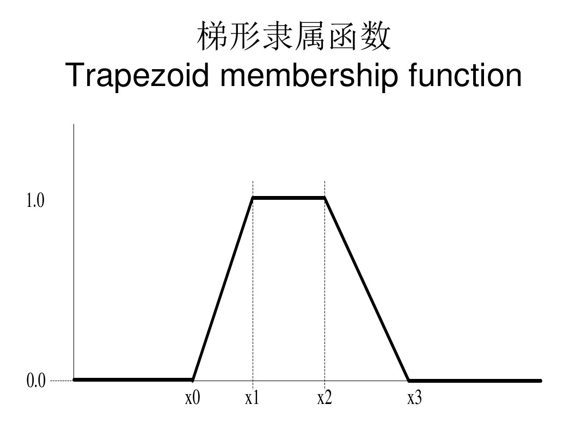
去模糊化->  将环境数值输入模糊机得到模糊值
根据模糊值来决定行动


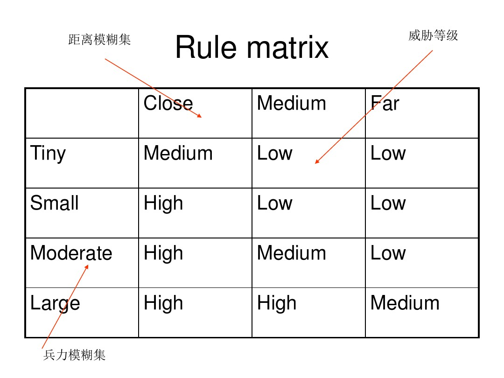
DISTANCE 0~5 CLOSE
DISTANCE 3~8 MEDIUM
DISTANCE 6~50 FAR

POWER 0~100 TINY
POWER 50-200 SMALL
POWER 200-500 MODERATE
POWER 400-1000 LARGE


<div STYLE="page-break-after: always;"></div>
--------------------
--------------------


# 决策
基于可控程度排列的决策系统


---

|类型|描述|
|:-|:-|
|脚本驱动| TimeLine剧场
|有限状态机FSM| 最常见的行为模型,枚举状态以及状态的改变
|分层有限状态机HFSM| 有限状态机的加强
| 行为树behavior-tree| 正向树执行
| 目标导向型行动计划GOAP|  反向树搜索
| 分层任务网络HTN| 分解任务
| 效用系统utility-based-system| 模糊数+随机
| 神经网络-强化学习| 基于value + 基于action


<div STYLE="page-break-after: always;"></div>

--------------------
--------------------

### 脚本驱动
可控程度最高，大量应用于 程序化过场动画 等应用场景
脚本还会再其他类型中出现，但那个不能称为脚本驱动
```
function xxx()
    local lili = GetPeople("lili");
    local mike = GetPeople("mike");
    lili:MoveTo(4,7);
    camera:LookTo(lili);
    camera:MoveTo(3,6);
    time:Wait(7);

    mike:Sit();
    lili:Sit();
    
    camera:LookTo(mike);
    time:Wait(7);


    lili:PlayAnim("anim_look_at_left");
    sound:play("lili_3-4-77");
    
end
```
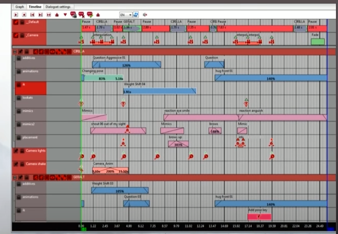


------
### 规则驱动
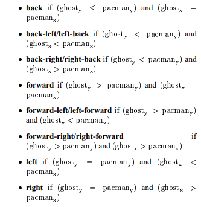


------

### 有限状态机FSM
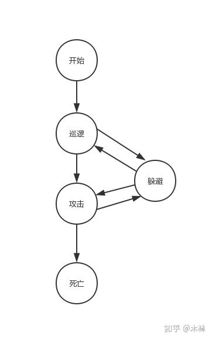
有限的N个状态之间的转换
它定义了一些状态（State）以及在这些状态之间的转移（Transition）和动作（Action）等行为的数学模型。

状态机有三个特征：

状态（State）总数是有限的。
在任一时刻，只处于一种状态。
在某种条件（Event）下，会从某种状态转移（Transition）到另一种状态，同时执行某个动作（Action）。


有限状态机是目前游戏AI中最常见的行为模型。
状态机的代码简单又快速，使用上强大、灵活、计算开销小
```
enum StateType{state_RunAway, state_Patrol, state_Attack};
void Agent::UpdateState(StateType CurrentState)
{
  switch(CurrentState)
  {
  case state_RunAway:
     EvadeEnemy();
     if (Safe())
     {
       ChangeState(state_Patrol);
     }
     break;
  case state_Patrol:
    FollowPatrolPath();
    if (Threatened())
    {
      if (StrongerThanEnemy())
      {
        ChangeState(state_Attack);
      }
      else
      {
        ChangeState(state_RunAway);
      }
    }
    break;
  case state_Attack:
    if (WeakerThanEnemy())
    {
       ChangeState(state_RunAway);
    }
    else
    {
      BashEnemyOverHead();
    }
    break;
  }//end switch
}
```


也可以是c++化的
```
class State
{
    GameObject* m_pOwner;
public:
    State(GameObject* pOwner)
    : m_pOwner(pOwner)
    { }
    virtual ~State() { }
    virtual void OnEnter() { }
    virtual void OnExit() { }
    virtual void OnUpdate(float deltaTime) { }
protected:
    GameObject* GetOwner() const { return m_pOwner; }
};
class Transition
{
    GameObject* m_pOwner;
public:
    Transition(GameObject* pOwner)
    :m_pOwner(pOwner)
    { }
    virtual bool ToTransition() const = 0;
};
class StateMachine
{
    typedef std::pair<Transition*, State*> TransitionStatePair;
    typedef std::vector<TransitionStatePair> Transitions;
    typedef std::map<State*, Transitions> TransitionMap;
    TransitionMap m_transitions;
    State* m_pCurrState;
public:
    void Update(float deltaTime);
};
```


简单状态转换表

|当前状态|条件|状态转换|
|:-|:-|:-|
|Runaway|Safe|Patrol|
|Attack|WeakerThanEnemy|RunAway|
|Patrol|Threatened AND StrongerThanEnemy|Attack|
|Patrol|Threatened AND WeakerThanEnemy |RunAway|

有限状态机虽然好，但是它有很大的缺点，当状态少的时候可以运用自如，当状态多的时候10个以上就已经结构非常复杂，而且容易出错。
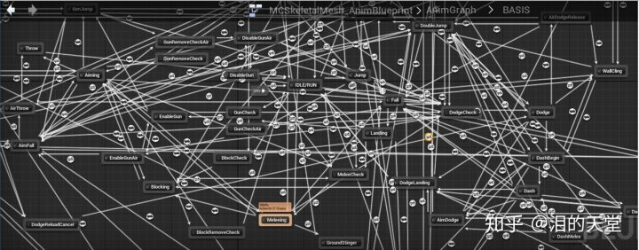


状态转移图 from sims4
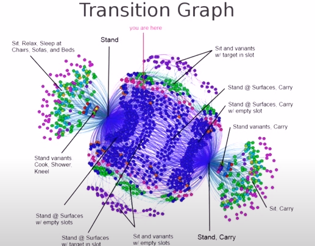
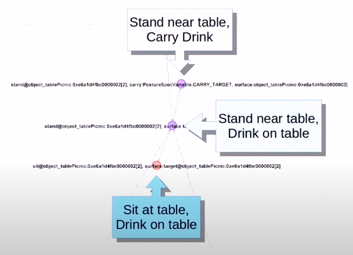


------
### 分层有限状态机HFSM
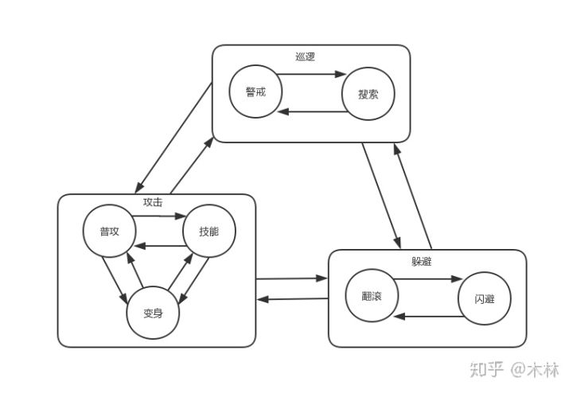
分层有限状态机中是一个嵌套的状态机

from < HELO2 >
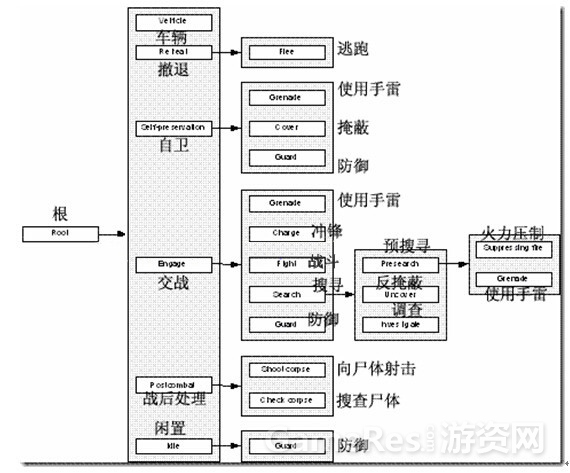
FSM基本上属于无数据状态机
但HFM高层状态一般都会存储部分数据

from < Final Fantasy XV>
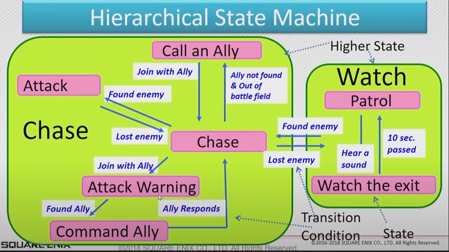
------
### 行为树behavior-tree
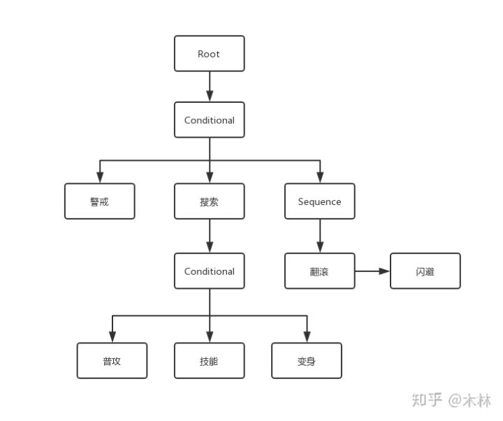
行为树是树型结构的，每个节点都代表了一个行为，每个行为都可以有子行为。

对于非常大的行为树，遍历整个树的成本可能令人望而却步。
因此，在传统行为树中引入了子树的概念。
一方面子树可以用来复用已有的行为树，另一方面执行子树无需调用整个树，直到满足某些条件才能退出子树。
但是，这又陷入了控制和调试有限状态机的状态转换之间相关复杂性问题。
from < Final Fantasy XV>
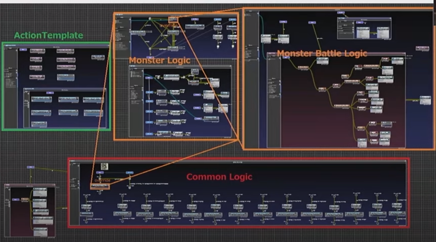

好处是貌似可以直接丢给策划了，实际上策划的逻辑能力很难做出一个好的行为树，程序规划出来的行为树往往可能是策划写出来的行为树的1/3，1/2.

所以需要各种离线优化，比如简单判断前置，比如自动行为树优化等


from < Tom Clancy's The Division >
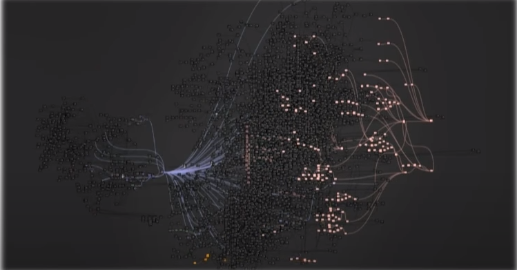
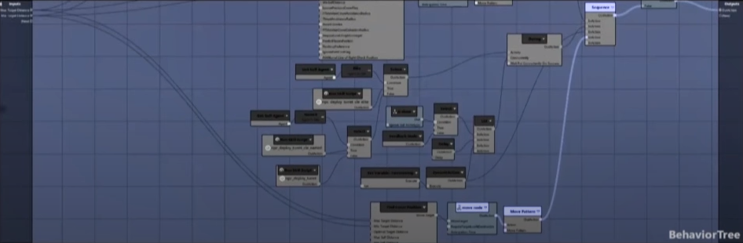

from < Witcher 3 >
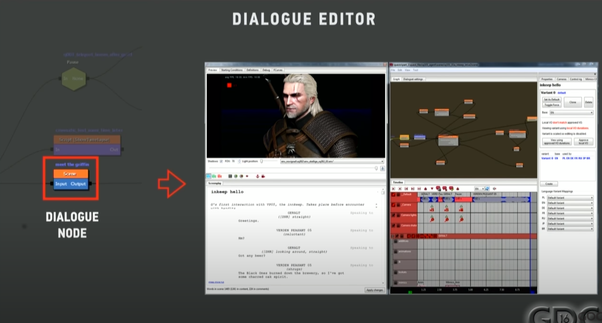

from < Final Fantasy XV >
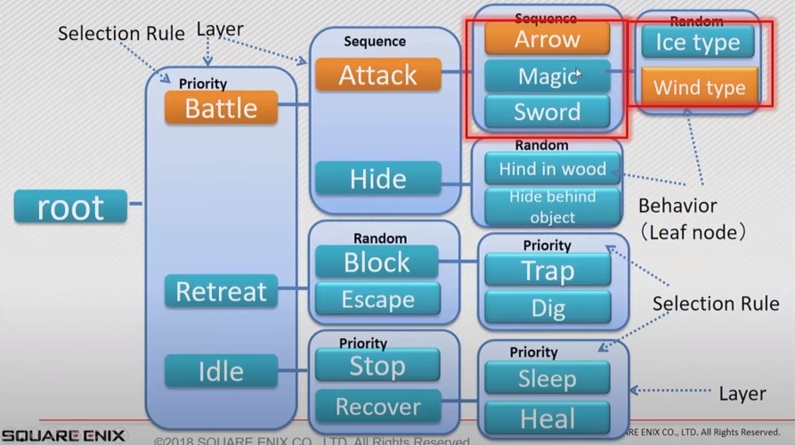

------

### 目标导向型行动计划GOAP
例如，假设AI的目标是收集小麦。 人类可以通过许多不同的方式实现这一目标，例如：
• 寻找镰刀>>收割小麦>>获取小麦
• 寻找小麦青贮>>收割小麦>>获取小麦
• 用手收割小麦>>获取小麦

通过目标，反向搜索树，得到所有路径
根据决策函数来决定到底使用哪条路径

起源于FEAR系列
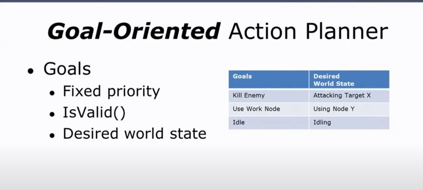
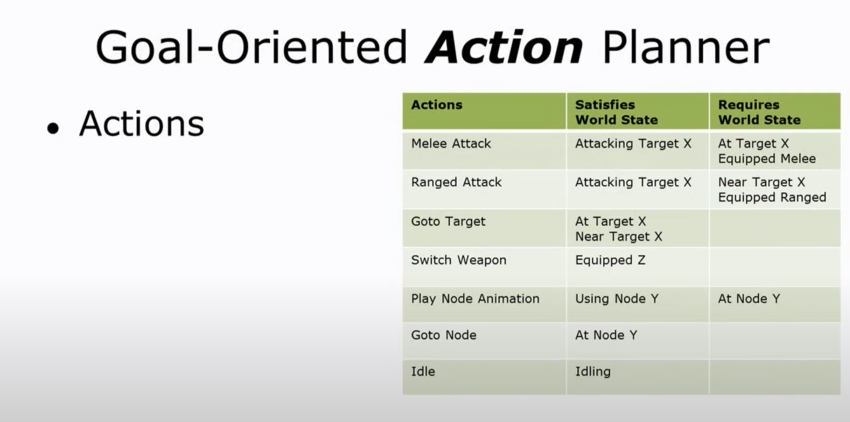
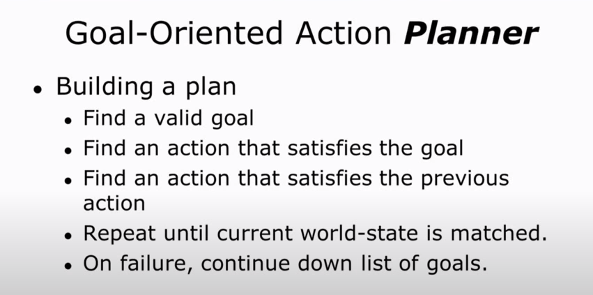
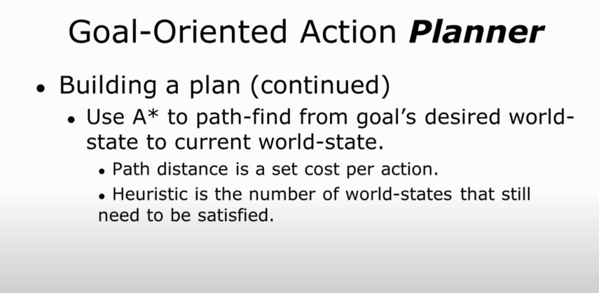

中土世界:暗影魔多(Middle-earth:Shadow of Mordor)

------

### 分层任务网络HTN
将目标拆解为多个目标，如果目标是复合目标，继续拆解，最后变成一个执行序列
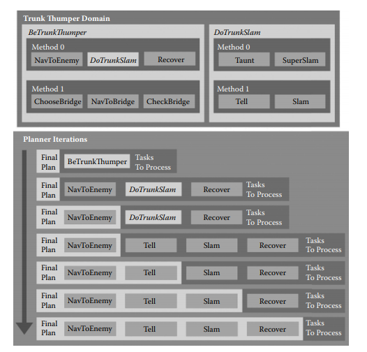

------

### 效用系统utility-based 
Utility AI不再是一层一层遍历需要执行的任务，而是利用“权重”告诉AI需要执行的任务。
在《杀戮地带2》、《极度恐慌》、《文明》、《光环2》等一系列3A游戏中都使用了此技术。相比于传统的行为树，Utility AI有以下优势：

. 设计简单：Utility AI通常可以用自然语言进行设计，这使AI程序员可以轻松地与游戏设计师对话。无需谈论一些神秘概念，例如条件，状态，序列和装饰器。相反，可以用“如果AI受到攻击，请优先寻找掩体”之类的术语来解释预期的AI行为。请注意如何使用模糊术语（例如“优先化”），这在人类对话中很自然。

. 易于扩展：规则-通常称为计分器，可以轻松添加到现有规则的顶部。与有限状态机相反，不需要破坏当前的结构。取而代之的是将计分器简单地添加到现有计分器之上，从而轻松扩展AI功能和保真度。

. 更高的质量：设计的简单性和可扩展的便捷性大大减少了错误并显着提高了生产效率。反过来，这为在给定的预算和时间框架内开发更复杂且行为良好的AI留出了更多空间，从而总体上提高了AI的质量。

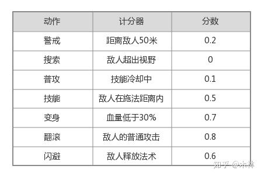
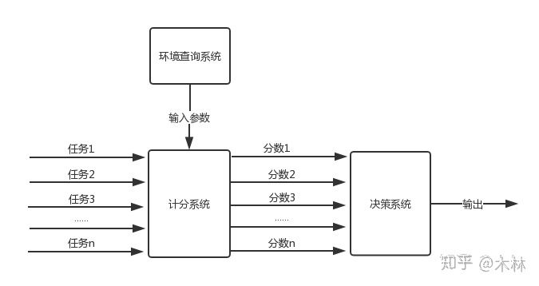

------
### 神经网络-强化学习
DDPG
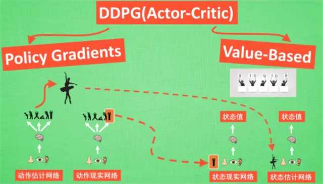
actor-critic 就是共用两种算法
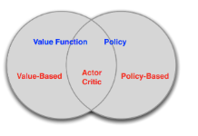

MADDPG 就是多人版本的 ddpg
主要是 加上编组，然后把xy的移动信息和距离作为参数传递 给网络 生成评价函数


执行动作->改变状态->产生值变化    
将动作/状态和数值变化都输入网络，来不停执行/预测/提高评估函数
动作需要记录动作序列器，来提高连招概率^_^
然后把队友/敌方的位置/移动信息，也输入，就可以产生对人对抗/协作


------
## 想一下
绝不是一定的， 很多系统会进行混用，
比如效用函数，可以混入行为树
脚本也可以插入FSM
关键不是模型，而是如何高效的开发
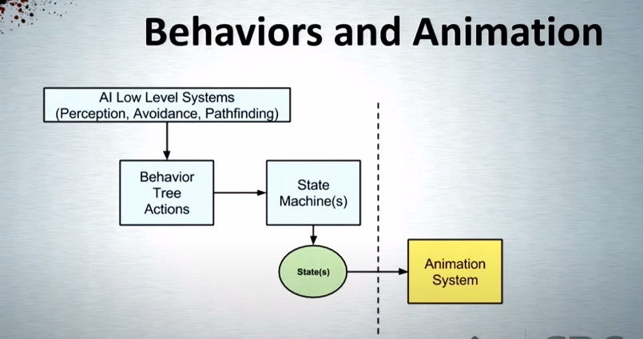


------
------


## 运动与寻路

### 数据准备
#### 基于网格
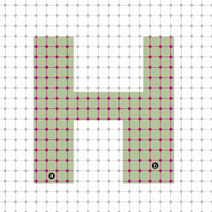
#### 基于导航点
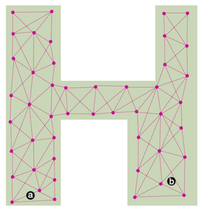
#### 基于导航网格
s
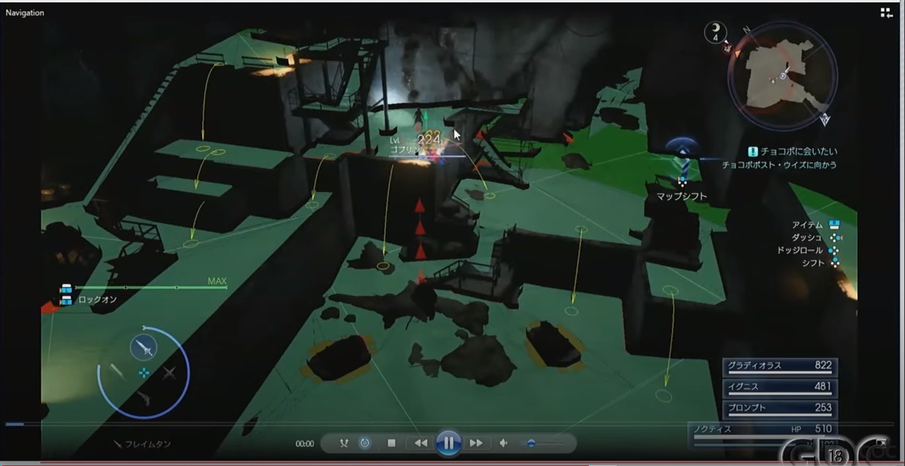
### 寻路算法
A* 最常用的寻路算法

A* with post-smoothed paths
Theta* Any-Angle Pathfinding
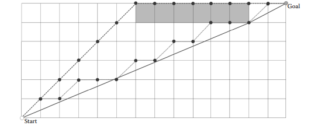

动态地图
D*算法
LPA*
IDA*

A* 的优化
JPS 通过预处理网格地图的跳点来加速
JPS+ 额外增加跳点到各方向的距离来加速
Goal Bounding 划分目标块来加速
jps+goal = fast 100x A*

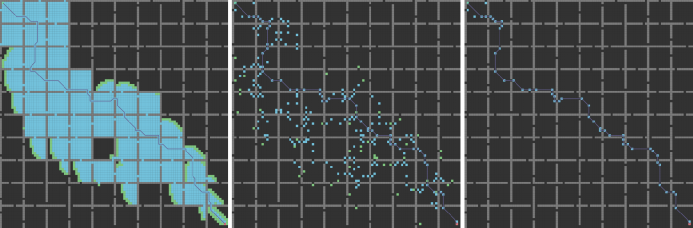
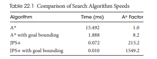

[Single-Agent Search Demo Page](https://www.movingai.com/SAS/)

### 个体移动
#### 碰撞预测 RVO
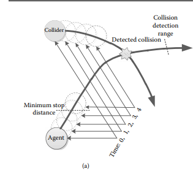
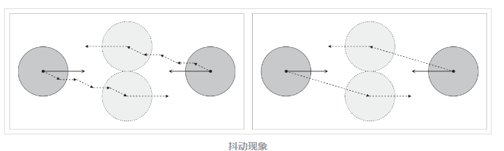

#### 通过navmesh查找cover点
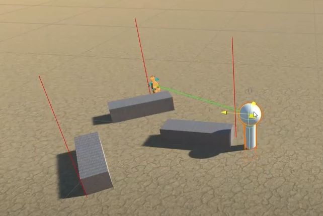

### 群组移动
群组一次寻路减少寻路次数， 分配路径，保持相互间的距离


#### 使用flow图移动

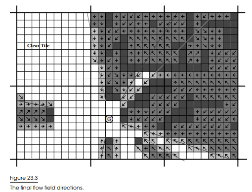


#### 分离：
每个角色都试着和相邻角色保持一定的距离。
#### 凝聚：
每个角色尽量不掉队，不落下太远。
#### 队列：
每个角色尽可能与相邻角色行动于同一方向。
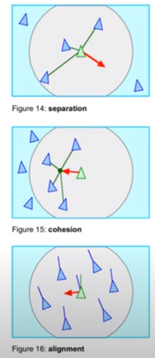


#### 编队运动中转向问题
只用转向圈，即圆心+转向半径进行计算
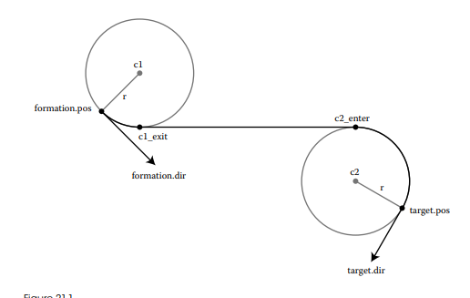


## MMO服务器AI实现中的一些优化点
1. 当AI对象周围没有玩家的时候，AI可以完全停止
2. AI的决策频率可以不一样
3. 通过将特定事件滞后处理，来解决AI事件风暴问题


## 推荐书籍
. AI-Game-Programming-Wisdom 
人工智能游戏编程真言 (Rabin S.) 庄越挺 吴飞清华大学出版社
英文版有4本 成书时间2002~2008

. Programming Game AI by Example
人工智能游戏编程案例精粹 (Mat Buckland) 罗岱 人民邮电出版社
成书时间2012

. Game-AI-Pro
英文版有3本, http://www.gameaipro.com/ 免费提供pdf
成书时间2013~2017

. Youtube.com
GDC-AI